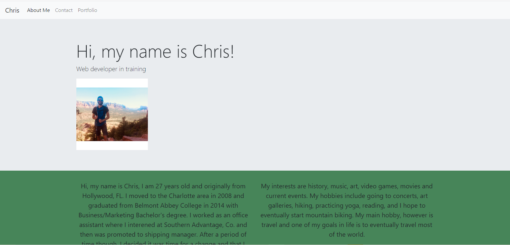

# Portfolio
Purpose: The purpose of this website is to present relevant information concerning my knowledge of web development for future employment. My bio and contact info is also available and updated on a regular basis.

Why it is useful: It is useful because it will demonstrate all of my best work and will show employers that I am ready and able to tackle all of the tasks they present me with.

Current author: Maintenance and further contributions are made by Christopher Gonzalez.

Link for deployed website: 

[Website] (https://spiralout92.github.io/Portfolio/)

Link for deployed website image: 

